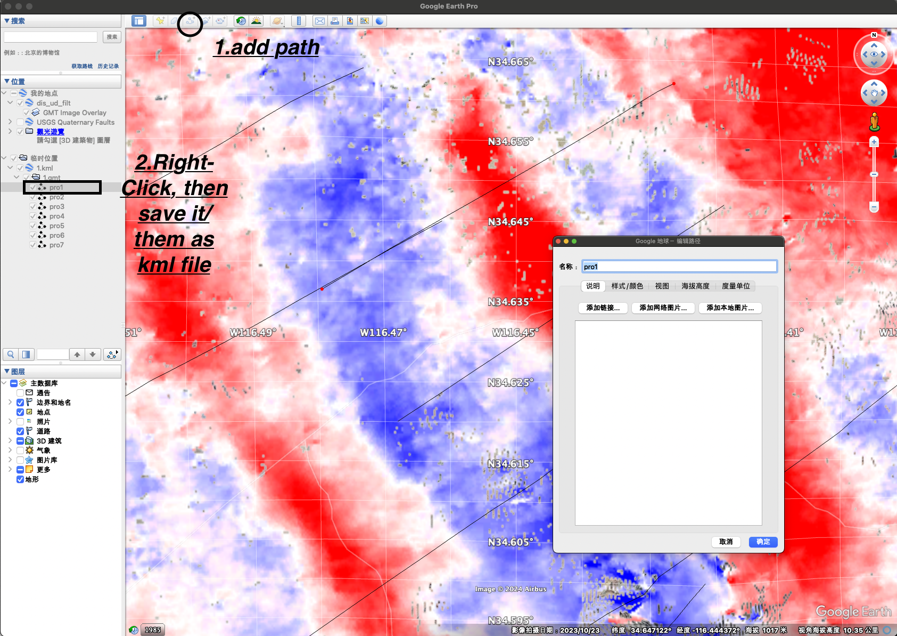

# Profile projection
Useful bash shell scripts for displacement extraction from image

## Usage
1. Find the cross-section of compliant fault through Google Earth and Save as **kml file**

2. Run following to extract the displacement along the cross-section
```
sh kml2pro.sh profile.kml input_image interval_distance(units in km)
# e.g. sh kml2pro.sh profile.kml dis_ew.grd 0.03
```